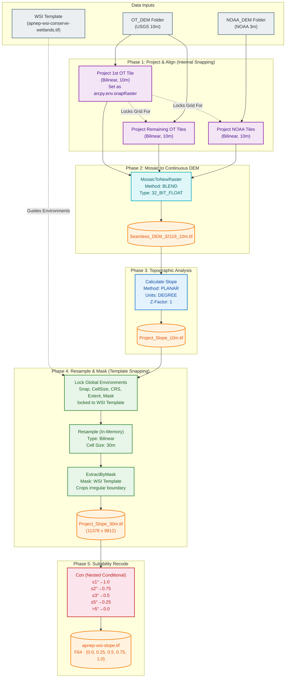

# Slope Layer Reproduction Notes

The slope layer is reproduced based on the OT_DEM, and NOAA_DEM found on Google Drive, then recoded into suitability scores for the WSI weighted overlay pipeline.

## Google Drive Links
| DEM Dataset | Resolution | Size | Number of Tiles |
|---| --- | --- | --- |
| [OT_DEM](https://drive.google.com/drive/u/0/folders/1UJuQzCXPm8aik8p9CTX4G69a0mKdDqHt)    | 10m   | 5.8 GB    | 4                 |
| [NOAA_DEM](https://drive.google.com/drive/u/0/folders/1pKhIaJjP1_jGNthvixPkGcBqfFxvtCno)  | 3m    | 14.4 GB   | 5                 |

## Raw Data Sources
> **Citation**:
>> 1. Department of Commerce (DOC), National Oceanic and Atmospheric Administration (NOAA), National Ocean Service (NOS), Office for Coastal Management (OCM). (2026). NOAA Office for Coastal Management Coastal Inundation Digital Elevation Model. Charleston, SC: NOAA's Ocean Service, OCM. Available online: https://coast.noaa.gov/slrdata/DEMs/index.html  
>> 2. United States Geological Survey (2021). United States Geological Survey 3D Elevation Program 1/3 arc-second Digital Elevation Model. Distributed by OpenTopography. https://doi.org/10.5069/G98K778D

Drafted update of the NOAA DEM is based on their [metadata](https://coast.noaa.gov/slrdata/DEMs/NC/NC_Middle1_metadata.xml) files, check file linked here for an example.

## Scripts used to generate the updated version of slope layer
Check [slope notebook](./dem_processing.ipynb)  
Also see the flow chart to get a visual representation of the overall process

## Flowchart exaplaining updated workflow inside the notebook
