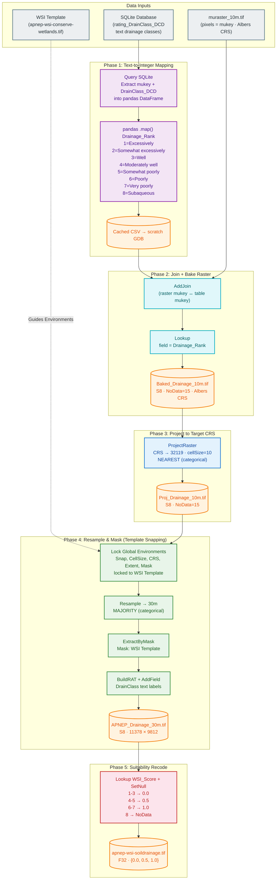

# Soil Layer Reproduction Notes

The soil drainage layer is reproduced from the SSURGO database via an SQLite portal, then recoded into suitability scores for the WSI weighted overlay pipeline.

## SSURGO guide & links
**Tutorial**:  
[SSURGO Soil Survey Data Youtube Guide](https://www.youtube.com/watch?v=4FGuxqxbCG0)  

**SSURGO Soil Survey Data Portal**:  
[SSURGO Soil Survey Data Portal Main Site](https://www.nrcs.usda.gov/resources/data-and-reports/ssurgo-portal)  
[SSURGO Soil Survey Data Portal User Guide](https://www.nrcs.usda.gov/sites/default/files/2024-11/SSURGO-Portal-User-Guide.pdf)

**SSURGO Soil Survey Data Bulk Downloader (ArcGIS Pro Toolbox)**:  
[SSURGO Soil Survey Data Bulk Downloader Guide](https://www.nrcs.usda.gov/sites/default/files/2023-09/SSURGO-Bulk-Downloader-ArcGIS-Pro-Installation-and-User-Guide.pdf)  
[SSURGO Soil Survey Data Bulk Downloader Download Link](https://www.nrcs.usda.gov/sites/default/files/2023-09/SSURGO-Bulk-Downloader-ArcGIS-Pro.zip)

## Data acquisition
Steps below can be treated as companions to the `SSURGO Bulk Downloader` and the `SSURGO Portal` guides and tutorials, whether pdf version or the youtube demo

1. Using `SSURGO Bulk Downloader` to get NC + VA Soil data into a local folder with ArcGIS Pro, [`SSURGO Bulk Downloader`](https://www.nrcs.usda.gov/sites/default/files/2023-09/SSURGO-Bulk-Downloader-ArcGIS-Pro.zip) is a ArcGIS Pro tool (also has a version for QGIS), the correct params for getting all NC/VA counties is `'NC*,VA*'`
2. Follow the guide to install and set up the `SSURGO Data Portal` on your machine and then create a database through the launched SSURGO Portal using the option of `sqlite` database in the drop down. (Note: geopackage version is not tested here and the [notebook](./ssurgo_soil_processing.ipynb) for processing afterwards are only compactible with sqlite database working with ArcGIS Pro at thie point)
3. Point the data folder to the working folder of step 1 to allow the portal to import the data (208 in total). 
4. After step 3, a `muraster_10m.tif` which would be automatically generated if following the tutorial of the portal, which is a map unit raster file for the region. The value of 'mukey' is a unique value for joining different category of soil rating data for downstream analysis.
5. On the SSURGO Portal, navigate to the SSURGO Data in Database Page, select all and then go to Soil Data Viewer tab of the portal, and search by `Drainage Class`. The dataset in this analysis used the option of `Dominant Condition`, which is the default aggregation method on the Portal. When you select it and click on 'Generate rating', a sqlite table `rating_DrainClass_DCD` would be generated

## Data dictionary
For the Drainage Class table, it does not have any kind of ranking for the `string` based decriptions, the following dictionary was used during the analysis process.
```
drainage_dict = {
    "Excessively drained": 1,
    "Somewhat excessively drained": 2,
    "Well drained": 3,
    "Moderately well drained": 4,
    "Somewhat poorly drained": 5,
    "Poorly drained": 6,
    "Very poorly drained": 7,
    "Subaqueous": 8
}
```

## Noteboook reproduction notes

1. There is a `base_directory` hard coded into the notebook for working with arcpy inside ArcGIS Pro pointing to the project folder root.  
2. There is a `raw_raster` and a `sqlite_db_path` associated with previous steps on interacting with
These need to be changed if reproducing using the [notebook](./ssurgo_soil_processing.ipynb)

## Flowchart exaplaining updated workflow inside the notebook

